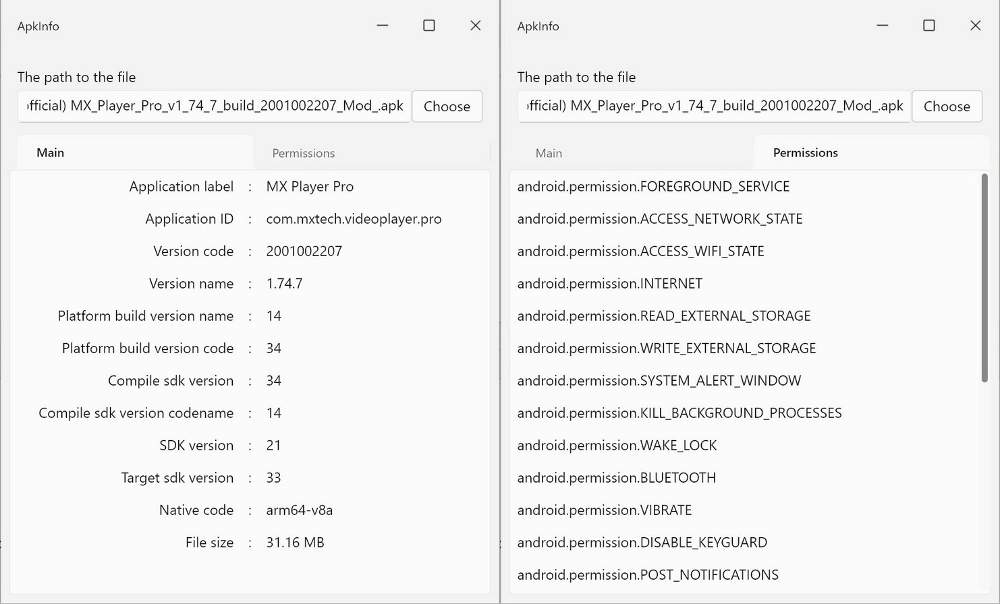

# ApkInfo

The application for viewing information about the apk file.




## Install on Windows

Run the script `apk_info_setup.ps1` to set associations with apk files.

## Build instructions

- Install the [Flutter SDK](https://docs.flutter.dev/get-started/install)

- Run code generation:

```bash
flutter pub get
```

```bash
flutter packages pub run build_runner build --delete-conflicting-outputs
```

- Run the code generation of text resources:

```bash
flutter gen-l10n
```

- Start the application build:

```bash
# for windows
flutter build windows --release
```

```bash
# for macos
flutter build macos --release
```

```bash
# for linux
flutter build linux --release
```
